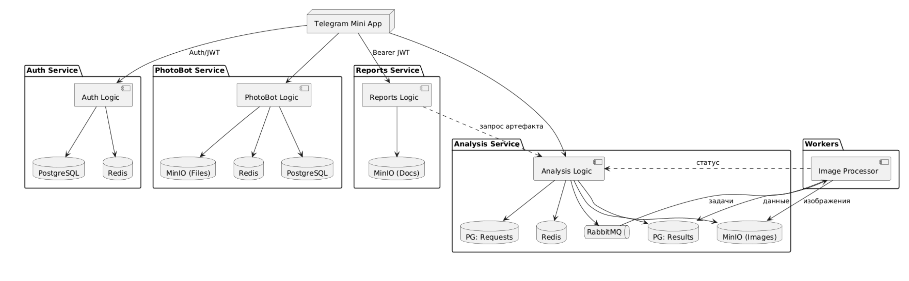

# Telegram-приложение для цифрового анализа характеристик растений

Информационная система для автоматизированного цифрового фенотипирования растений и семян. Позволяет заменить длительную ручную органолептическую оценку (от 30 минут на пробу) экспресс-анализом по фотографии со смартфона (до 3 минут на типовую пробу из ~227 объектов), сокращая трудозатраты при сохранении необходимой точности.

- **Автор:** Пархоменко Кирилл Александрович

---

## Описание платформы

Система представляет собой распределённое веб-приложение со встроенным клиентским доступом через **Telegram Mini Apps (Web App)** и административной панелью управления.

**Важное примечание.** Исходный код модулей компьютерного зрения (Workers) в репозитории не представлен, так как эти алгоритмы разрабатывались сторонними специалистами. Данный репозиторий содержит полноценную микросервисную платформу (оркестрация, хранение, СУБД, генерация отчётов, лимиты, аутентификация и фронтенд-приложения). Интеграция с внешним CV-обработчиком осуществляется по согласованному контракту асинхронного обмена через очереди RabbitMQ.

---

## Стек технологий

| Слой | Технологии |
|------|------------|
| **Backend** | Go 1.25+, [Fiber v3](https://gofiber.io/) |
| **Frontend** | TypeScript, React, Vite, TanStack Router, Tailwind CSS, Bun / Node.js 20+ |
| **Базы данных** | PostgreSQL (транзакционные БД), Redis (кэш, rate limiting, pub/sub для WS) |
| **Брокер сообщений** | RabbitMQ (асинхронный конвейер обработки задач) |
| **Объектное хранилище** | MinIO (S3-совместимое для исходных снимков и готовых PDF/CSV отчётов) |
| **Генерация отчётов** | chromedp (управление headless Chromium для экспорта HTML в PDF) |
| **Инфраструктура** | Docker, Docker Compose |
| **Наблюдаемость** | OpenTelemetry, zerolog |

---

## Архитектура системы

Система спроектирована на основе событийно-ориентированной микросервисной архитектуры (Event-Driven Architecture) для обеспечения отказоустойчивости при пиковых вычислительных нагрузках.



### Основные микросервисы и приложения

| Сервис | Назначение |
|--------|------------|
| **auth-service** | Аутентификация через `initData` Telegram Mini App, JWT (RS256), RBAC |
| **analysis-service** | Оркестрация заявок, жизненный цикл анализа, WebSocket-уведомления, Transactional Outbox |
| **classification-service** | Иерархические правила классификации семян |
| **reports-service** | Сбор статистик, генерация PDF/CSV из HTML-шаблонов |
| **photobox (backend)** | Бэкенд клиентского веб-приложения и каталога сорных растений |
| **photobox (frontend)** | SPA-клиент и Telegram Mini App |
| **admin-panel** | Панель администрирования AuthService |

---

## Структура репозитория

```text
kalibr/
├── services/
│   ├── auth-service/            # Сервис авторизации (Go)
│   ├── analysis-service/        # Сервис оркестрации заявок и WebSocket (Go)
│   ├── classification-service/  # Сервис правил классификации (Go)
│   ├── reports-service/         # Сервис генерации PDF/CSV отчётов (Go)
│   └── photobox/                # Бэкенд клиентского каталога растений (Go)
├── frontends/
│   ├── photobox/                # SPA-клиент и Telegram Mini App (React)
│   └── admin-panel/             # Панель администрирования Auth-сервиса (React)
├── docs/                        # Архитектурные схемы, протокол испытаний
└── README.md
```

Каждый сервис — изолированный модуль со своим `Dockerfile`, `compose.yml`, `Makefile` и примером переменных окружения (`compose.template.env` или `compose.dev.env.example`).

---

## Быстрый старт

### Системные требования

- Docker и Docker Compose
- Go 1.25+ (для локального запуска Go-сервисов)
- Bun или Node.js 20+ (для сборки фронтенда)

### 1. Запуск Go-сервисов (режим разработки)

**auth-service** (поднимает Postgres и Redis, создаёт учётную запись `dev` / `dev` при `DEV_MODE=true`):

```bash
cd services/auth-service
cp compose.dev.env.example compose.env
make dev
```

Для остальных Go-сервисов сначала поднимите зависимости через `make dev` или `make dev-up`, затем запустите приложение (`go run ./cmd/app` или цель `make dev`, если она определена в `Makefile` сервиса).

**analysis-service** — локальный стек зависимостей включает **две отдельные PostgreSQL-базы**:

| База | Порт (dev) | Назначение |
|------|------------|------------|
| `kalibr` | 5436 | Результаты анализов (`analysis_new`) |
| `requests` | 5435 | Заявки, outbox, жизненный цикл обработки |

```bash
cd services/analysis-service
make dev          # docker-compose-dev.yml: kalibr_db, request_db, Redis, RabbitMQ, MinIO
```

В production `DB_*` указывает на внешнюю БД анализов; в `compose.yml` поднимается только `request_db`.

### 2. Запуск клиентского фронтенда (photobox)

```bash
cd frontends/photobox
make dev
```

Интерфейс: <http://localhost:5173/login> (логин `dev` / `dev`).

Локальная эмуляция Mini App: <http://localhost:5173/?mock=messenger>

### 3. Запуск панели администратора (admin-panel)

Локальная разработка (Vite, порт 3000):

```bash
cd frontends/admin-panel
bun install   # или npm install
bun run dev   # или npm run dev
```

Через Docker Compose:

```bash
cd frontends/admin-panel
cp compose.env.example compose.env
docker compose --env-file compose.env -f compose.yml up --build
```

---

## Работа через мессенджер Telegram

Чтобы авторизоваться в системе под своей учётной записью Telegram через Mini App, зарегистрируйте бота в `auth-service` через **admin-panel**:

1. Запустите `auth-service` и `admin-panel`, войдите под учётной записью администратора.
2. Откройте раздел **Боты** и нажмите «Добавить бота».
3. Укажите:
   - **Платформу** — `Telegram` или `MAX`;
   - **Имя бота** — имя, зарегистрированное у BotFather (используется для проверки подписи `initData`);
   - **Токен** — API-ключ бота из BotFather (Telegram) или панели MAX.
4. Настройте Mini App в мессенджере так, чтобы он открывал `frontends/photobox` с тем же именем бота.

Без зарегистрированного бота `auth-service` не сможет проверить подпись `initData`, и вход из мессенджера завершится ошибкой.

---

## Тестирование

[Протокол интеграционных испытаний](docs/integration-test-protocol.pdf)

### Backend (Go)

```bash
cd services/<имя-сервиса> && go test ./...
```

Интеграционные тесты (где определены в `Makefile` сервиса):

```bash
cd services/analysis-service && make test.integration
cd services/auth-service && make test-integration
cd services/classification-service && make test-integration
```

### Frontend

```bash
cd frontends/photobox && bun test:run
cd frontends/admin-panel && bun test
```
